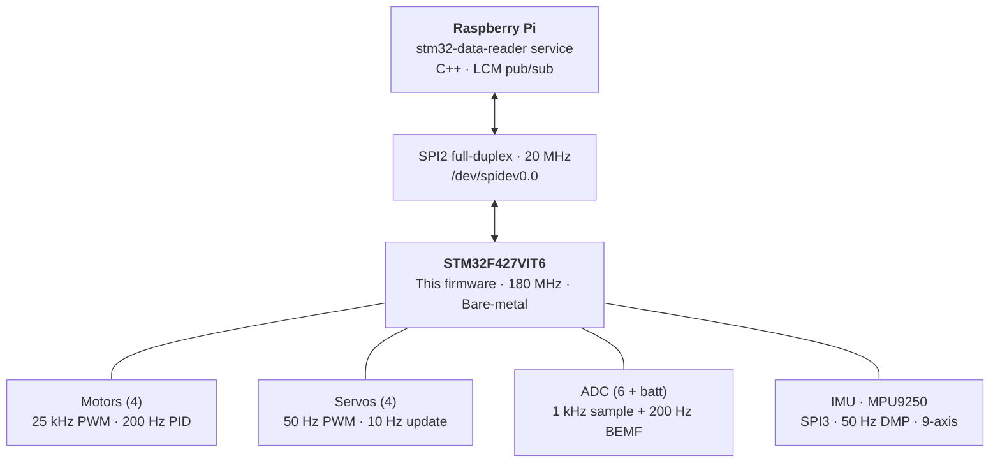
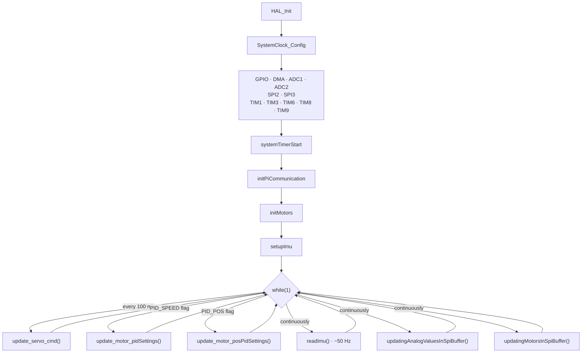
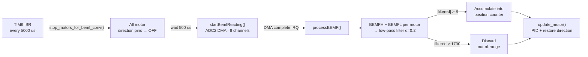
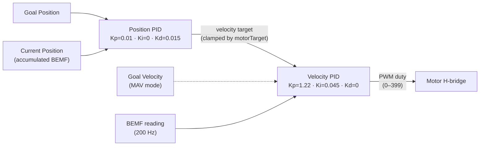

# Wombat Firmware

Bare-metal firmware for the **STM32F427VIT6** microcontroller on the KIPR Wombat robotics controller. The firmware
handles all real-time I/O: motor control (including PID), servo driving, sensor reading (analog, digital, IMU), and
communication with a Raspberry Pi companion over SPI.

## Table of Contents

- [System Overview](#system-overview)
- [Repository Structure](#repository-structure)
- [Building](#building)
- [Deploying and Flashing](#deploying-and-flashing)
- [Architecture](#architecture)
    - [Main Loop and Timing](#main-loop-and-timing)
    - [SPI Protocol](#spi-protocol)
    - [Motor Control](#motor-control)
    - [BEMF Sensing](#bemf-sensing)
    - [PID Controller](#pid-controller)
    - [Servo Control](#servo-control)
    - [IMU (MPU9250)](#imu-mpu9250)
    - [Analog and Digital Sensors](#analog-and-digital-sensors)
- [Hardware Pin Map](#hardware-pin-map)
- [Clock Configuration](#clock-configuration)
- [Companion: STM32 Data Reader](#companion-stm32-data-reader)
- [Adding or Changing a Peripheral](#adding-or-changing-a-peripheral)
- [Common Pitfalls](#common-pitfalls)
- [Authors and Contributors](#authors-and-contributors)

---

## System Overview



The STM32 runs a bare-metal super-loop. All timing is interrupt-driven from a 1 MHz system timer (TIM6). The Pi sends
commands and receives sensor data via a continuously-running circular SPI DMA transfer.

---

## Repository Structure

```
Firmware-Stp/
├── CMakeLists.txt          # Root CMake config (project "wombat")
├── build.sh                # Local build: clean + cmake + make
├── deploy.sh               # Docker build + SCP + flash via SSH
├── Dockerfile              # ARM cross-compile environment
├── CMake/
│   └── GNU-ARM-Toolchain.cmake
├── Firmware/               # All firmware source code
│   ├── CMakeLists.txt      # Firmware build target (wombat.elf → .bin)
│   ├── Startup/
│   │   └── startup_stm32f427vitx.s
│   ├── include/
│   │   ├── main.h          # Pin defines, HAL handles, Error_Handler
│   │   ├── Actors/
│   │   │   ├── motor.h     # Motor structs, direction enum, control API
│   │   │   ├── pid.h       # PID controller struct and functions
│   │   │   └── servo.h     # Servo structs and modes
│   │   ├── Communication/
│   │   │   ├── pi_buffer_struct.h      # TxBuffer / RxBuffer (shared with Pi)
│   │   │   ├── communication_with_pi.h # TRANSFER_VERSION, extern buffers
│   │   │   └── spi.h                   # SPI2 (Pi) and SPI3 (IMU) init
│   │   ├── Sensors/
│   │   │   ├── bemf.h          # BEMF state machine, timing constants
│   │   │   ├── adcInit.h       # ADC1/ADC2 init
│   │   │   ├── adcPorts-batteryVoltage.h
│   │   │   ├── digitalPorts.h
│   │   │   └── IMU/            # MPU9250 driver, DMP, config
│   │   ├── Hardware/
│   │   │   ├── gpio.h / dma.h / timer.h / timerInit.h
│   │   │   └── interupt_prioryty.h     # All IRQ priority constants
│   │   └── Data_structures/
│   │       └── filter.h        # Inline low-pass filter
│   └── src/
│       ├── main.c              # Entry point, super-loop
│       ├── Actors/
│       │   ├── motor.c         # Motor control: mode dispatch, PID integration
│       │   ├── pid.c           # PID algorithm with anti-windup
│       │   └── servo.c         # Servo update, 6V enable
│       ├── Communication/
│       │   ├── communication_with_pi.c  # Buffer init, DMA start
│       │   └── spi.c                    # SPI2/SPI3 config, DMA callback
│       ├── Sensors/
│       │   ├── bemf.c                   # BEMF measurement + position accumulation
│       │   ├── adcPorts-batteryVoltage.c
│       │   ├── adcInit.c
│       │   ├── digitalPorts.c
│       │   └── IMU/                     # imu.c, MPU9250.c, mpu9250_hal.c, mpu9250_dmp.c
│       └── Hardware/
│           ├── gpio.c / dma.c / timer.c / timerInit.c
│           └── stm32f4xx_it.c           # All ISR handlers
├── libs/
│   ├── CMSIS/                  # ARM Cortex-M4 headers
│   ├── STM32F4xx_HAL_Driver/   # ST HAL library
│   └── motion_driver_6.12/     # InvenSense eMD 6.12 + MPL prebuilt binary
├── linker/
│   ├── STM32F427VITx_FLASH.ld
│   └── STM32F427VITx_RAM.ld
├── docs/
│   ├── Datasheets/
│   ├── Schematics/
│   └── Wombat_BOM_rev4.xlsx
└── flashFiles/                 # Scripts for flashing from the Pi
```

---

## Building

### Prerequisites

- ARM GCC toolchain (`arm-none-eabi-gcc`) in PATH, **or** Docker
- CMake 3.24+

### Local Build

```bash
./build.sh
```

This deletes `build/`, runs CMake with the ARM toolchain file, and builds. Output: `build/Firmware/wombat.bin`.

### Docker Build

```bash
docker compose up --build
```

The container cross-compiles and places the binary in `build/`.

---

## Deploying and Flashing

```bash
# Set the Pi IP (default 10.101.156.14)
export RPI_HOST=<pi-ip>

./deploy.sh
```

This will:

1. Build inside Docker
2. SCP `wombat.bin` and flash scripts to the Pi
3. Stop `stm32_data_reader.service`
4. Flash the STM32 via `flash_wombat.sh`
5. Restart `stm32_data_reader.service`

---

## Architecture

### Main Loop and Timing

The firmware is bare-metal (no RTOS). The `main()` function initializes all peripherals in order, then enters an
infinite loop:



**TIM6 (1 MHz system timer)** drives all periodic sampling from its ISR:

| Interval                | Action                                            |
|-------------------------|---------------------------------------------------|
| Every 5000 us           | `stop_motors_for_bemf_conv()` - begins BEMF cycle |
| 500 us after BEMF start | `startBemfReading()` - triggers ADC2 DMA          |
| Every 1000 us           | `sampleAnalogPorts()` - triggers ADC1 DMA         |

When ADC2 completes (DMA interrupt), `processBEMF()` runs immediately, followed by `update_motor()` for all 4 channels.
This makes the **motor PID run at exactly 200 Hz**.

### SPI Protocol

The STM32 operates as an SPI slave on SPI2, communicating with the Pi using continuous circular DMA. Both sides exchange
a fixed-size buffer simultaneously on every transfer.

**Configuration:** Mode 1 (CPOL=0, CPHA=1), 8-bit, MSB first, hardware NSS.

**Transfer version:** Both sides must agree on `TRANSFER_VERSION` (currently **6**). A mismatch causes the Pi reader to
retry and eventually reset the STM32.

**Buffer size:** `max(sizeof(TxBuffer), sizeof(RxBuffer))` bytes per direction.

#### TxBuffer (STM32 → Pi)

```c
typedef struct __attribute__((packed)) {
    uint8_t    transferVersion;       // Must equal TRANSFER_VERSION
    uint32_t   updateTime;            // Microsecond timestamp
    MotorData  motor;                 // .bemf[4], .position[4], .done (bitmask)
    int16_t    analogSensor[6];       // 6 analog input ports
    int16_t    batteryVoltage;        // Raw 12-bit ADC, 11x voltage divider
    uint16_t   digitalSensors;        // Bits 0-9: DIN ports, bit 10: button
    ImuData    imu;                   // Gyro, accel, compass, linearAccel,
                                      // accelVelocity, quaternion, temperature
} TxBuffer;
```

#### RxBuffer (Pi → STM32)

```c
typedef struct __attribute__((packed)) {
    uint8_t          transferVersion;
    uint32_t         updates;             // Update flags + parity (bit 7)
    uint8_t          systemShutdown;      // Bit 0: servos, bit 1: motors
    uint16_t         motorControlMode;    // 3 bits per motor (see Motor Control)
    int32_t          motorTarget[4];      // Meaning depends on control mode
    int32_t          motorGoalPosition[4];// Target position for MTP mode
    uint8_t          servoMode;           // 2 bits per servo
    uint16_t         servoPos[4];         // Servo pulse width
    MotorPidSettings motorPidSettings;    // Runtime-adjustable PID gains
} RxBuffer;
```

#### Update Flags

The `updates` field uses even parity to guard against corrupted transfers:

| Flag                               | Value  | Effect                       |
|------------------------------------|--------|------------------------------|
| `PI_BUFFER_UPDATE_MOTOR_PID_SPEED` | `0x01` | Apply new velocity PID gains |
| `PI_BUFFER_UPDATE_MOTOR_PID_POS`   | `0x02` | Apply new position PID gains |
| `PI_BUFFER_UPDATE_PARITY_BIT`      | `0x80` | Even parity check bit        |

Updates are only applied when the parity check passes (`updates % 2 == 1`). The Pi clears all flags after each transfer.

### Motor Control

4 DC motors driven by H-bridges with 25 kHz PWM. Each motor has 3 bits in `motorControlMode`:

| Mode          | Value   | Behavior                                                                                                       |
|---------------|---------|----------------------------------------------------------------------------------------------------------------|
| OFF           | `0b000` | Direction pins low, PWM = 0                                                                                    |
| PASSIVE_BRAKE | `0b001` | Both direction pins high (short-brake), PWM = 0                                                                |
| PWM           | `0b010` | Direct duty cycle from `motorTarget[ch]` (0-399)                                                               |
| MAV           | `0b011` | Move At Velocity - PID velocity control. `motorTarget` = velocity setpoint                                     |
| MTP           | `0b100` | Move To Position - cascaded position + velocity PID. `motorGoalPosition` = target, `motorTarget` = speed limit |

**Direction** is derived from the PID output sign: positive = CW (D1 high), negative = CCW (D0 high).

**Mode changes** automatically reset both PID controllers and clear the done flag.

**Done detection** (MTP only): the `motorDone` bit for a channel is set when `|goalPosition - currentPosition| <= 50`
BEMF ticks.

### BEMF Sensing

Back-EMF is used both as a speed measurement (for velocity PID) and accumulated as a position estimate. The measurement
cycle runs at 200 Hz:



1. **Stop motors** - all direction pins to OFF to allow back-EMF to appear
2. **Wait 500 us** for the signal to stabilize
3. **Start ADC2** DMA conversion across 8 channels (2 differential per motor: BEMFH - BEMFL)
4. **Process** in the ADC completion ISR: compute differential, filter, accumulate position
5. **Resume motors** - direction pins restored by `update_motor()`

### PID Controller

Two independent loops per motor, cascaded in MTP mode:



**Velocity loop (inner):** Runs every BEMF cycle (200 Hz). Directly outputs a PWM duty cycle.

| Parameter | Default                                          |
|-----------|--------------------------------------------------|
| Kp        | 1.22                                             |
| Ki        | 0.045                                            |
| Kd        | 0.0                                              |
| iMax      | 399 (anti-windup clamp on integral contribution) |
| outMax    | 399 (output clamp = max duty cycle)              |

**Position loop (outer, MTP mode only):** Outputs a velocity target for the inner loop.

| Parameter | Default |
|-----------|---------|
| Kp        | 0.01    |
| Ki        | 0.0     |
| Kd        | 0.015   |

**Anti-windup:** The integral *contribution* (`Ki * accumulated_error`) is clamped, and the raw accumulator is
back-calculated to prevent drift:

```c
float iTerm = pid->kI * pid->iErr;
if (iTerm > pid->iMax) { iTerm = pid->iMax; pid->iErr = pid->iMax / pid->kI; }
```

All gains can be overridden at runtime from the Pi via `MotorPidSettings` in the RxBuffer.

### Servo Control

4 standard hobby servos at 50 Hz PWM. Each servo has a 2-bit mode in `servoMode`:

| Mode           | Value | Behavior                                                     |
|----------------|-------|--------------------------------------------------------------|
| FULLY_DISABLED | 0     | PWM off, 6V supply disabled if all servos are fully disabled |
| DISABLED       | 1     | PWM off for this servo, but 6V supply stays on               |
| ENABLED        | 2     | PWM active at the position in `servoPos[n]`                  |

The 6V servo power supply (PE10) is enabled when any servo is not FULLY_DISABLED.

Servo positions update at 10 Hz to avoid jitter from SPI timing variations.

### IMU (MPU9250)

The MPU9250 9-axis IMU is connected via SPI3 (firmware is master). It uses the InvenSense embedded Motion Driver (eMD)
6.12 stack with DMP firmware:

- **DMP features:** 6-axis low-power quaternion, raw accelerometer, calibrated gyroscope, gyro auto-calibration
- **MPL features:** 9-axis sensor fusion, fast no-motion detection, gyro temperature compensation, vector compass
  calibration, magnetic disturbance detection
- **Output rates:** 50 Hz gyro/accel, 10 Hz compass, 0.5 Hz temperature
- **Self-test:** Run at startup, biases applied to hardware offset registers

Data extracted into `txBuffer.imu`:

| Field           | Type     | Units                                      |
|-----------------|----------|--------------------------------------------|
| `gyro`          | float[3] | rad/s                                      |
| `accel`         | float[3] | m/s^2                                      |
| `compass`       | float[3] | uT                                         |
| `linearAccel`   | float[3] | m/s^2 (gravity subtracted, body frame)     |
| `accelVelocity` | float[3] | m/s (integrated linear accel, 0.998 decay) |
| `quat`          | float[4] | unit quaternion (w, x, y, z)               |
| `temperature`   | float    | degrees C                                  |

Each sensor field includes an `accuracy` byte (0 = uncalibrated, 3 = fully calibrated).

### Analog and Digital Sensors

**Analog (ADC1):** 6 user ports (AIN0-AIN5) + battery voltage, sampled at 1 kHz via DMA. 12-bit resolution, 3.3V
reference. Battery has an 11x voltage divider.

**Digital:** 10 input ports (DIN0-DIN9) + 1 built-in button, packed into a `uint16_t`. Inputs use internal pull-ups (
active low for DIN, active high for button).

---

## Hardware Pin Map

### Motor PWM

| Motor | Timer | Channel | Pin  | Direction D0 | Direction D1 |
|-------|-------|---------|------|--------------|--------------|
| 0     | TIM1  | CH1     | PA8  | PD1          | PD7          |
| 1     | TIM1  | CH2     | PA9  | PE15         | PC13         |
| 2     | TIM1  | CH3     | PA10 | PC14         | PC15         |
| 3     | TIM8  | CH1     | PC6  | PD10         | PD11         |

### Servo PWM

| Servo | Timer | Channel | Pin |
|-------|-------|---------|-----|
| 0     | TIM3  | CH3     | PC8 |
| 1     | TIM3  | CH2     | PC7 |
| 2     | TIM9  | CH2     | PE6 |
| 3     | TIM9  | CH1     | PE5 |

Servo 6V enable: PE10

### SPI

| Bus  | Role         | SCK  | MISO | MOSI | CS              |
|------|--------------|------|------|------|-----------------|
| SPI2 | Pi (slave)   | PB13 | PB14 | PB15 | PB12 (hw NSS)   |
| SPI3 | IMU (master) | PC10 | PC11 | PC12 | PE2 (soft, CS0) |

### ADC

| Function      | Pin     | ADC/Channel |
|---------------|---------|-------------|
| AIN0          | PB1     | ADC1/ch9    |
| AIN1          | PC1     | ADC1/ch11   |
| AIN2          | PC2     | ADC1/ch12   |
| AIN3          | PC3     | ADC1/ch13   |
| AIN4          | PC4     | ADC1/ch14   |
| AIN5          | PC5     | ADC1/ch15   |
| Battery       | PC0     | ADC1/ch10   |
| MOT0 BEMF H/L | PA0/PA1 | ADC2/ch0-1  |
| MOT1 BEMF H/L | PA2/PA3 | ADC2/ch2-3  |
| MOT2 BEMF H/L | PA4/PA5 | ADC2/ch4-5  |
| MOT3 BEMF H/L | PA6/PA7 | ADC2/ch6-7  |

### Digital Inputs

| Port      | Pin       |
|-----------|-----------|
| DIN0-DIN3 | PD12-PD15 |
| DIN4      | PB9       |
| DIN5      | PB8       |
| DIN6      | PC9       |
| DIN7      | PE0       |
| DIN8      | PE1       |
| DIN9      | PE4       |
| Button    | PB0       |

### Other

| Signal       | Pin              |
|--------------|------------------|
| USER_LED     | PE9 (active low) |
| UART TX (Pi) | PB10 (USART3)    |
| UART RX (Pi) | PB11 (USART3)    |

---

## Clock Configuration

| Clock  | Frequency | Source                                        |
|--------|-----------|-----------------------------------------------|
| SYSCLK | 180 MHz   | HSI 16 MHz → PLL (M=8, N=180, P=2), overdrive |
| AHB    | 180 MHz   | SYSCLK / 1                                    |
| APB1   | 45 MHz    | AHB / 4 (timer base = 90 MHz after x2)        |
| APB2   | 90 MHz    | AHB / 2 (timer base = 180 MHz after x2)       |

**Timer frequencies:**

| Timer | Prescaler | Period | Frequency | Purpose                        |
|-------|-----------|--------|-----------|--------------------------------|
| TIM6  | 9         | 10     | 1 MHz     | System timer (1 us resolution) |
| TIM1  | 18        | 400    | 25 kHz    | Motor PWM (duty 0-399)         |
| TIM8  | 18        | 400    | 25 kHz    | Motor 3 PWM                    |
| TIM3  | 90        | 20000  | 50 Hz     | Servo 0-1 PWM                  |
| TIM9  | 181       | 20000  | 50 Hz     | Servo 2-3 PWM                  |

---

## Companion: STM32 Data Reader

The Pi-side service lives at a separate repository. It:

1. Opens `/dev/spidev0.0` at 20 MHz
2. Performs full-duplex SPI transfers at ~1 kHz
3. Validates `transferVersion` on every read
4. Publishes all sensor data to LCM multicast channels (prefix `libstp/`)
5. Subscribes to LCM command channels and writes them to the SPI TX buffer

Both the firmware `pi_buffer_struct.h` and the reader's `pi_buffer.h` must be kept in sync. Any field change requires
bumping `TRANSFER_VERSION` on both sides.

### Key LCM Channels

**Published (sensor data):**

- `libstp/gyro/value`, `libstp/accel/value`, `libstp/mag/value` - IMU vectors
- `libstp/imu/quaternion` - orientation quaternion
- `libstp/linear_accel/value` - gravity-subtracted acceleration
- `libstp/motor/{0-3}/value` - motor BEMF (speed proxy)
- `libstp/motor/{0-3}/position` - accumulated BEMF ticks
- `libstp/motor/{0-3}/done` - position goal reached flag
- `libstp/analog/{0-5}/value` - analog port readings
- `libstp/digital/{0-10}/value` - digital port states
- `libstp/battery/voltage` - battery voltage

**Subscribed (commands):**

- `libstp/motor/{0-3}/power_cmd` - direct PWM (-100 to +100)
- `libstp/motor/{0-3}/velocity_cmd` - velocity PID setpoint
- `libstp/motor/{0-3}/position_cmd` - position command (velocity + goal)
- `libstp/motor/{0-3}/pid_cmd` - runtime PID gain tuning
- `libstp/servo/{0-3}/position_cmd` - servo position
- `libstp/servo/{0-3}/mode` - servo enable/disable
- `libstp/system/shutdown_cmd` - shutdown motors/servos

---

## Adding or Changing a Peripheral

1. **Add the field** to `TxBuffer` or `RxBuffer` in `Firmware/include/Communication/pi_buffer_struct.h`
2. **Mirror the change** in the Pi reader's `include/spi/pi_buffer.h` (must be byte-identical layout)
3. **Bump `TRANSFER_VERSION`** in both `Firmware/include/Communication/communication_with_pi.h` and the reader's
   `pi_buffer.h`
4. **Write the driver** in `Firmware/src/Sensors/` or `Firmware/src/Actors/`
5. **Hook it into the main loop** or an ISR callback in `timer.c` / `stm32f4xx_it.c`
6. **Update the Pi reader** to publish/subscribe the new data on LCM

### Checklist for buffer struct changes

- [ ] Both `pi_buffer_struct.h` files are identical
- [ ] `TRANSFER_VERSION` bumped on both sides
- [ ] All structs use `__attribute__((packed))`
- [ ] New fields are placed at the end (or both sides rebuilt together)
- [ ] `BUFFER_LENGTH_DUPLEX_COMMUNICATION` recalculates automatically

---

## Common Pitfalls

- **Buffer struct mismatch:** If the firmware and reader buffer structs diverge, the Pi will detect a version mismatch,
  retry, and eventually reset the STM32. Always update both sides together.
- **BEMF during motor stop:** BEMF is measured by briefly cutting motor power every 5 ms. This is normal and does not
  affect perceived motor speed. However, code that changes motor direction pins outside the BEMF cycle can interfere
  with measurements.
- **`update_motor()` runs in ISR context:** It is called from the ADC2 DMA completion interrupt, not the main loop. Do
  not add blocking code or printf calls here.
- **Parity check:** The `updates` field must have correct even parity (bit 7). If parity fails, all update flags are
  silently ignored for that transfer.
- **Motor port ordering:** The physical motor array in `motor.c` is swapped (ports 0/1 and 2/3 are reversed in the
  `motors[]` array) to match the PCB silkscreen numbering.
- **IMU SPI speed change:** `setupImu()` changes SPI3 prescaler from /256 to /64 after initialization. Any SPI3 code
  that runs before IMU setup uses the slower speed.

---

## Authors and Contributors

- Matthias Greil - Firmware
- Tobias Madlberger - integration to wombat
